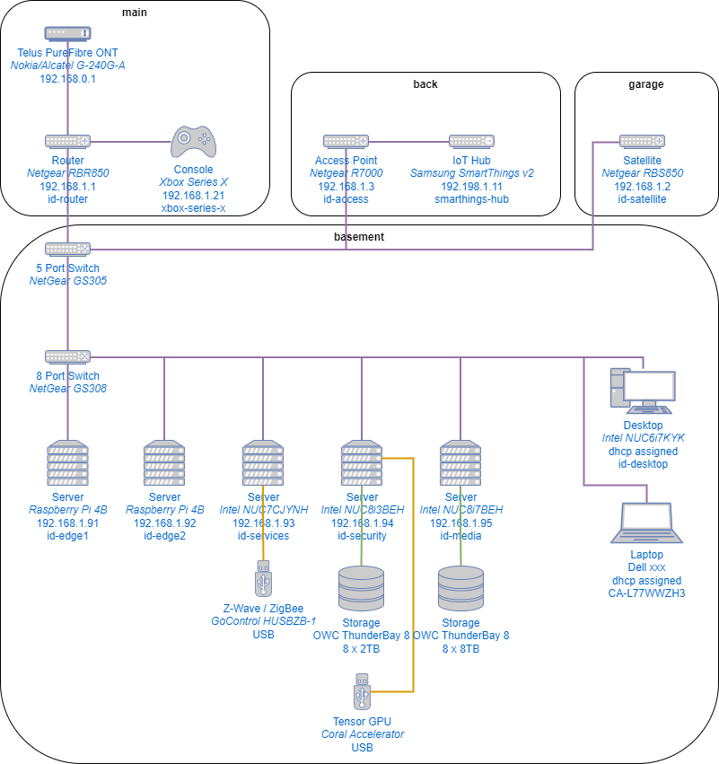
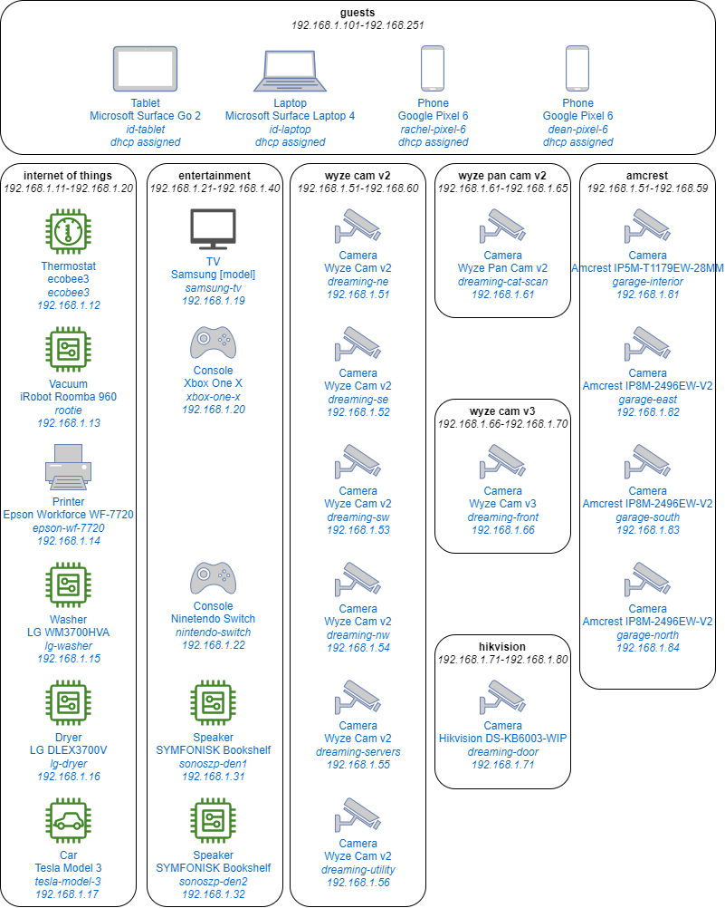
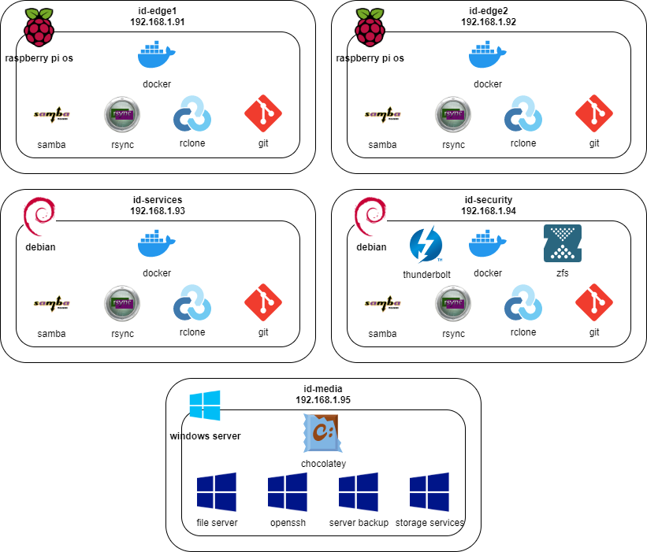
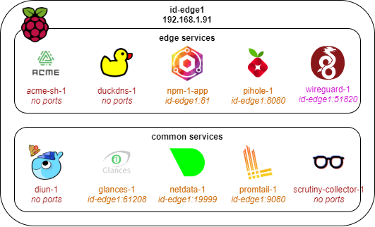
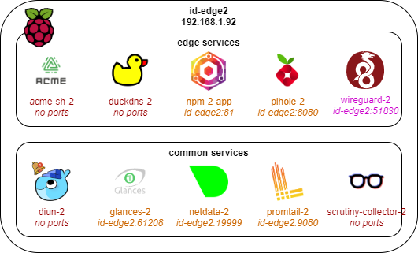
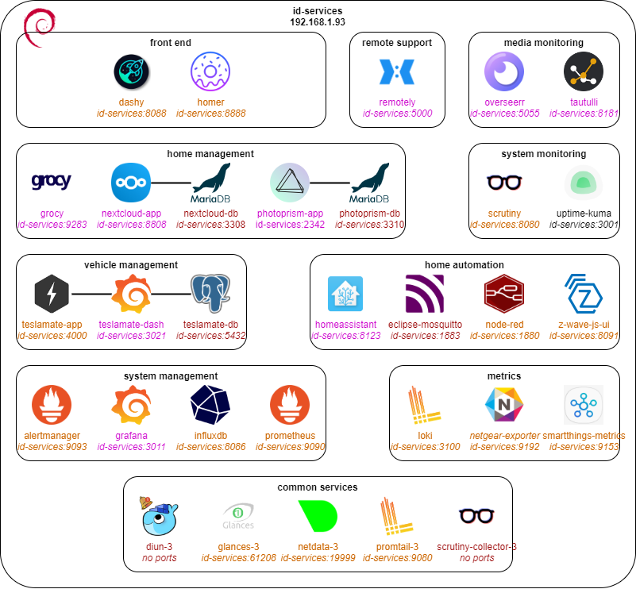
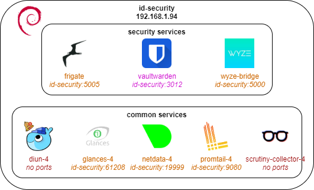
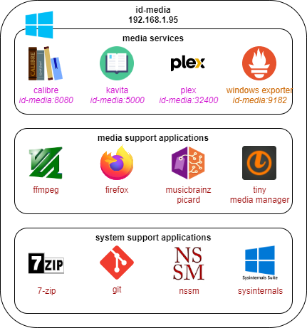
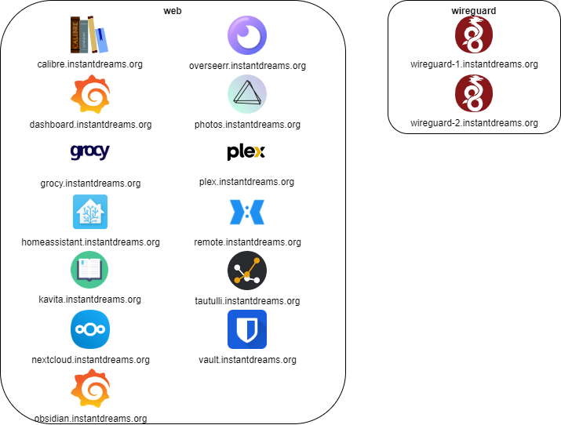
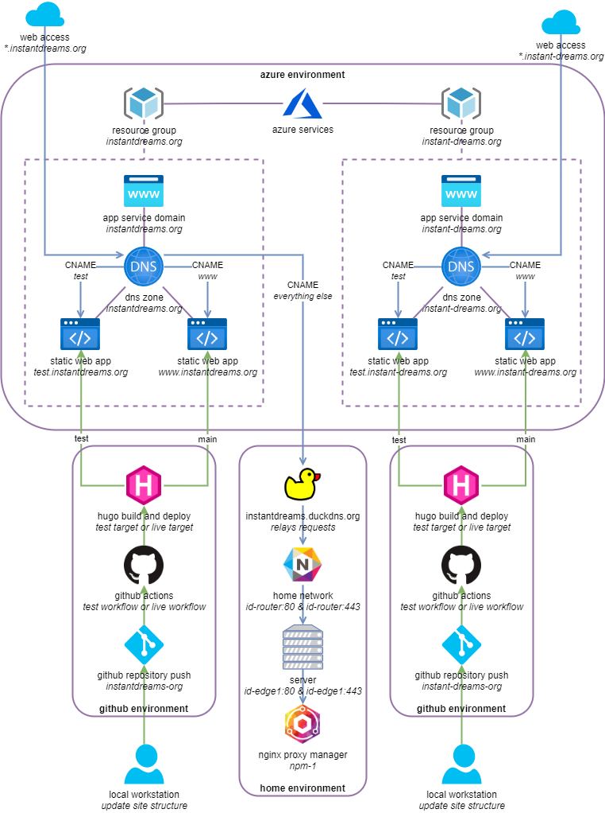

# Instant Dreams Home Network

Details of my home network, for sharing.

## History

I started self-hosting in 2011 with Windows Server Essentials, and used Windows exclusively to manage my fileshares. It was a good exercise in learning technology as well as managing my own hosting.

This grew as time went on into using Raspberry Pi devices as ad-blockers, which meant I had to learn Linux. I realised that a good way to manage my services was through containers, and so I moved my stack to Docker. I've experimented with various docket networking modes, dabbled with kubernetes for my self hosted services, but at the moment my infrastructure and topography are relatively stable.

## Network Layout

I use my 1G fibre internet connection to connect 5 servers, 2 workstations, and various networking and IoT devices using wired networking:

My pi-hole devices manage my DHCP reservation and allocation, and I manage the ranges for my wireless devices:

Having this level of control over my network is useful to avoid collisions. I could expand this in the future to include managed switches and virtual networks.

## Servers

I have five machines dedicated as servers:

* **id-edge1** & **id-edge2** - edge servers
  * Raspberry Pi 4B
  * 2GB RAM
  * 120GB SSD (via USB3 SATA adapter)
* **id-services** - services server
  * Intel NUC7CJYHN
  * 16GB RAM
  * 500GB SSD
* **id-security** - security server
  * Intel NUC8i3BEH
  * 32GB RAM
  * 250GB SSD
* **id-media** - media server
  * Intel NUC8I5BEH
  * 32GB RAM
  * 500GB SSD

The two **edge** servers run Raspberry PI OS Lite (64-bit) for a smaller footprint. The **services** and **security** servers run Debian (64-bit) headless. The **media** server runs Windows Server 2022 Standard. I access and manage all 4 linux servers using ssh. I can also access the windows server using SSH, but mostly use remote desktop.

Along with the operating system, each server is installed with a base set of software applications and tools:

I am striving to follow the [configuration as code](https://www.cloudbees.com/blog/configuration-as-code-everything-need-know) best practises, and each server has a corresponding GitHub repository that contains configuration files and documentation on how to install and configure the base operating system and the various tools needed to support the services.

For the Linux servers the repositories also include individual folders containing the compose and environment files to set up each service.

The steps to get the docker containers running are:
1. Clone the repository to `/srv`

2. For each service:

   2.1. Copy `.env.example` file to `.env`

   2.2. Edit the `.env` file for any device or service specifics

   2.3. Run `docker compose up --detach`

3. Check docker container status for all services

The use of .env files mean no passwords or other sensitive information are held in GitHub repositories, even if they are private.

I am interested in looking into Anisble or other provisioning tools to make the rebuild of each server even easier, which would implement [infrastructure as code](https://en.wikipedia.org/wiki/Infrastructure_as_code). Not enough hours in the day at the moment, though.

### Edge Servers

The following services are run on the edge servers:

id-edge1 | id-edge2
:--:|:--:
 | 

A description of the unique services:
* **acme-sh**
  * A shell script for the Automated Certificate Management Environment - used to manually create and export wildcard certificates with LetsEncrypt as needed
* **duckdns**
  * Runs a cron job that updates DuckDNS with my current home ip address
* **npm**
  * Reverse proxy with a user interface with Nginx behind the scenes, can generate Letsencrypt certificates (but the Azure challenge is broken right now, hence the use of acme-sh)
* **pihole**
  * Used to manage DNS, DHCP, and block ads and tracking
* **wireguard** (external access)
  * Allows remote devices (phones, laptops, tablets) to create a VPN connection to the network and use services as if they were home

### Services Server

The following services are run on the services server:

A description of the unique services:
* **dashy**
  * Home dashboard that shows all of the services logically grouped
* **homer**
  * Home dashboard that shows all of the services logically grouped
* **remotely** (external access)
  * Allows someone to request a remote connection so I can fix their PC for them (perils of being in IT, right?)
* **overseer** (external access)
  * Plex users can request things
* **tautulli** (external access)
  * Provides statistics and status of the Plex server
* **grocy** (external access)
  * An enterprise resource planning tool for your pantry
* **nextcloud** (external access)
  * Cloud storage for your home, has a very good mobile app
* **photoprism** (external access)
  * Photo management for your home which includes face and object recognition
* **scrutiny**
  * Consolidated and presents SMART data from HDDs and SSDs on each server
* **uptime-kuma**
  * Monitors services and endpoints, with notification
* **teslamate** (external access)
  * Logging of Tesla data, with Grafana as a visualisation tool
* **homeassistant** (external access)
  * Consolidate all your smart home devices with full control
* **mqtt**
  * Message queue used by various services
* **node-red**
  * Visual flow management tool for Internet of Things devices
* **z-wave-js-ui**
  * Plug in to manage z-wave USB device
* **alertmanager**
  * Sends notifications based on threshold issues found by Prometheus
* **grafana** (external access)
  * Visualisation tool - creates dashboards, graphs, and other fun things
* **influxdb**
  * Time series database to capture information from services and devices
* **prometheus**
  * Time series database to capture information from services and devices
* **loki**
  * Log aggregation for Grafana visualisation
* **netgear-exporter**
  * Exports metrics from NetGear routers
* **smartthings-metrics**
  * Exports metrics from SmartThings hubs

### Security Server

The following services are run on the services server:

A description of the unique services:
* **frigate**
  * A network video recorder with object detection - using a Coral USB Accelerator
* **vaultwarden**
  * Password management (a much easier implementation of BitWarden)
* **wyze-bridge**
  * Creates a bridge to any Wyze cameras and creates an RTSP stream that can be consumed by an NVR

### Media Server

The following services are run on the media server:

A description of the unique services:
* **calibre** (external access)
  * eBook management
* **kavita** (external access)
  * eBook server
* **plex** (external access)
  * Media server
* **windows-exporter**
  * Exports metrics from Windows devices

## External Access

Certain services are exposed externally to the internet:

My domain names services are managed in Azure DNS Zones. The routing is as follows:
1. Request from browser
2. DNS lookup on Azure
3. Routed to DuckDNS
4. Relayed to home IP address
5. Received by router
6. Forwarded to id-edge1
7. Processed by Nginx Proxy Manager
8. Redirected to appropriate service

Note that this also works internally as follows:
1. Request from browser
2. Received by PiHole
3. Forwarded to id-edge1
4. Processed by Nginx Proxy Manager
5. Redirected to appropriate service

In addition to the home environment there are static web apps hosted on Azure that are created with Hugo and updated on push to an appropriate repository with GitHub actions:

# Conclusion

I am still working to get my homelab set up just right. I don't see that changing any time soon.

I do hope to provision uptime-kuma + traefik in an Azure Kubernetes Service at some point, just to test the playbook for such things.

I also hope to work more on the monitoring and reporting aspect of my network, using the data catpures in InfluxDB and Prometheus to create Grafana visualisations.

