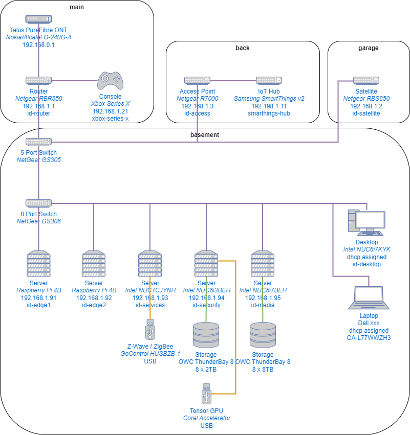

# Instant Dreams Home Network

Details of my home network, for sharing.

## History

I started self-hosting in 2011 with Windows Server Essentials, and used Windows exclusively to manage my fileshares. It was a good exercise in learning technology as well as managing my own hosting.

This grew as time went on into using Raspberry Pi devices as ad-blockers, which meant I had to learn Linux. I realised that a good way to manage my services was through containers, and so I moved my stack to Docker. I've experimented with various docket networking modes, dabbled with kubernetes for my self hosted services, but at the moment my infrastructure and topography are relatively stable.

## Network Layout

Physical network:

Physical network transparent:

Public repository with details of my homelab configuration

Rob's Homelab

A homelab is something that a technical person puts together for things like smart home, security camera or home automation such as sprinkler systems or monitoring energy consumption.
My case

Probably the easiest way to document my journey into this hobby is by answering the 5 W's; who, what, where, when and why as best as I can of course.
Five W's
Who

I am a solution architect by day, and avid computer geek hobbyist by night. I am fortunate that my career is one where I enjoy everything about the profession, and also have a strong passion to learn more about the industry whenever I can. It is this passion for understanding, and being more hands on that I think helps me absorb new information rapidly in order to apply it in my work life.
What

What do I use my homelab for, well as mentioned in the introduction above it is basically tinkering, but also evolves from real world scenarios as a home owner, and parent. I dabble in the hardware realm to understand more about how computers work, and applying my software experience to simplify technology for my family to use.

For security I have a number of cameras including doorbells that help keep the family safe especially when we are away from home. Bettering the technology at home for WiFi with almost all family members working from home in some capacity put a strain on resources, and being the techie at home I am required to provide 24x7 support. Keeping my kids Macbooks backed-up on my network storage device, or for convenience having access to my personal cloud storage synchronized at home. I setup my Network Video Recording (NVR) solution using cameras manufactured for/by TP-Link and Wyze (I love these guys), and the software that marries all of this together is called Frigate. With features such as object detection (distinguising people from animals and cars) the strain put on my hardware was a lot, enter Google Coral which is a USB Machine Learning device no bigger than a normal memory stick. As small as it is, it can handle a few hundred-trillion (yes, 400 terraflops) computations making it faster and more efficient than any desktop processor on the market. This little guy also whips some highend graphics cards around especially when power consumption is a consideration.
Where

My homelab hobby began in 2000 when I became a home owner with my wife, in what initially was an office since I worked from home quite a bit, and being on-call required a dedicated space in order to not disturb the rest of the family. As we moved from one house to another, I "smartened" up our house by wiring it up for ethernet either myself or through our contractor building the home. This, to connect my TV with me WiFi, and network storage for recording, or playing back home videos. My passion for doing this in my own home has also helped influence my family and close friends in what they need around their house.
When

I do this stuff when I can, again working fulltime and having a family requires balance. When I am not actively tinkering I turn to YouTube channels for ideas, and learning more about what other hobbyists are up to. I also have my fellow hobbyists who admittedly are doing really cool things too, and that inspires me more.
Why

Why do I bother? I do this because it is an active learning experience, and one where I can control costs. With smart technologies, gadgets and life around the home including the parenthood activities it is sometimes a driver when security, or being energy-wise. When the COVID pandemic struck in 2020, the need for a homelab increased since most of the family "worked" from home either as a professional, or as a fulltime student. It almost became a job, repairing my daughter's computer after a crash, or restoring from a previous backup give me premium capabilities to support the fam.

Before COVID, I think that the Cryptocurrency craze, and hardware frenzy for graphics cards to process millions of computations per second made you money. The better and faster your cards, the more you could earn, and expand the "farm". These cryptocurrency locations required a lot of power, and required a lot of cooling to maintain high efficiency and increase hardware longevity. Heat is bad on computer parts.

I am learning Linux to add to my Windows, and Mac knowledge.

This experience has helped me appreciate the roles of server and cloud adminstrators since I am essentially running my own private cloud.
How

Ok I am going to sneak in the how, how do I find the ideas, "stuff" to build my computers. I blame Social Media (joking), but I turn to Facebook Marketplace, Kijiji, and Government Surplus sites for hardware. I love home reno shows and take junk to turn it into treasure, and flip it towards funding my next project. Oh yea, eBay is also a fvorite of mine. I reserve buying new stuff for my own PC as well as my family's stuff.

Opensource software is King for hobbyists, and computer enthusiasts looking for good quality software. Operating systems like Ubuntu Linux, and ported over versions of these to run small appliances like a customer internet router called pfSense.
My Topology/ Layout